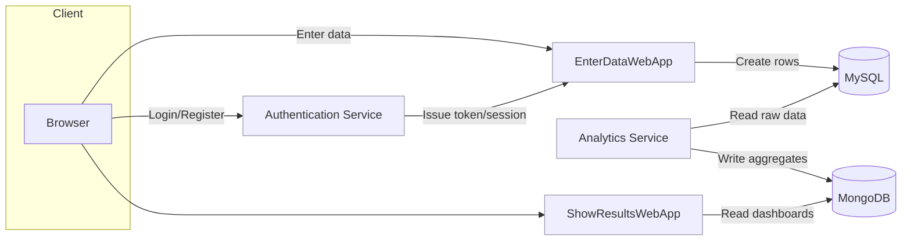

# Docker-Containerized Microservices — Data Collection & Analytics System

End-to-end **containerized microservices** stack for entering data, persisting it, computing analytics, and serving results—wired together with **Docker Compose**.

## Architecture



## Repository Structure

```
.
├─ Authentication Service/
├─ EnterDataWebApp/
├─ Analytics Service/
├─ ShowResultsWebApp/
├─ MySql DB/
├─ Mongo DB/
└─ docker-compose.yml
```

> Optional doc found in repo: `Containerized Microservices Data Collection and Analytics System.pdf`

## Features

* **EnterDataWebApp** writes user-submitted records to **MySQL**.
* **Authentication Service** issues tokens/sessions for protected flows.
* **Analytics Service** reads MySQL, computes aggregates, stores results in **MongoDB**.
* **ShowResultsWebApp** serves dashboards/tables from **MongoDB**.
* Everything bootstrapped locally with **`docker compose`**.

---

## Prerequisites

* **Docker 24+** and **Docker Compose v2+**
* Local ports used in `docker-compose.yml` must be free.

## Configuration

Create a root `.env` (Compose auto-loads it). Adjust names to match your `docker-compose.yml` and service configs.

### MySQL

```dotenv
MYSQL_ROOT_PASSWORD=change_me
MYSQL_DATABASE=app_db
MYSQL_USER=app_user
MYSQL_PASSWORD=change_me
```

### MongoDB

```dotenv
MONGO_INITDB_ROOT_USERNAME=admin
MONGO_INITDB_ROOT_PASSWORD=change_me
```

### App Services (examples—align with your code)

```dotenv
AUTH_JWT_SECRET=please_change_me
AUTH_PORT=8081

ENTER_APP_PORT=8082
RESULTS_APP_PORT=8083
ANALYTICS_PORT=8084
```

> If you change DB creds after first boot, recreate containers **and volumes**:
> `docker compose down -v && docker compose up -d`

## Quick Start

```bash
# From repo root
docker compose build
docker compose up -d
docker compose logs -f   # Ctrl+C to stop tailing
```

## Default Access (adjust to your compose ports)

* **Authentication Service:** `http://localhost:<auth_port>`
* **EnterDataWebApp:** `http://localhost:<enter_port>`
* **ShowResultsWebApp:** `http://localhost:<results_port>`
* **Analytics Service (if HTTP):** `http://localhost:<analytics_port>`
* **MySQL:** `localhost:3306` (or mapped port)
* **MongoDB:** `localhost:27017` (or mapped port)

## Data Flow

1. User authenticates (Authentication Service).
2. **EnterDataWebApp** validates input and writes rows to **MySQL**.
3. **Analytics Service** reads raw rows, computes metrics, writes to **MongoDB**.
4. **ShowResultsWebApp** queries Mongo and renders dashboards.

## Local Development (run one service outside Docker)

```bash
# Example: run EnterDataWebApp locally
cd "EnterDataWebApp"
npm install
npm run dev    # or npm start
```

Point the app to Dockerized DB hosts (`mysql`, `mongo`) or to the host-mapped ports.

## Initialization & Seeds

* **MySQL**: Place `*.sql` under the init path mounted in Compose so they run on first start.
* **MongoDB**: Seed via files mounted to `/docker-entrypoint-initdb.d/` on first start.

## Observability & Health

* Tail logs: `docker compose logs -f <service>`
* Consider adding simple `/health` endpoints and Compose `healthcheck` blocks.

## Troubleshooting

* **Ports in use** → change host port mappings in `docker-compose.yml`.
* **Service ↔ DB connectivity** → verify service names, env vars, and mapped ports.
* **MySQL user not created** → ensure `MYSQL_USER`, `MYSQL_PASSWORD`, and (optionally) `MYSQL_DATABASE` are set on first boot.
* **Mongo auth errors** → both `MONGO_INITDB_ROOT_USERNAME` and `MONGO_INITDB_ROOT_PASSWORD` must exist **before** first boot.


